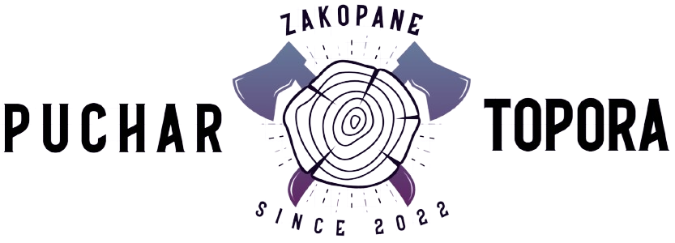
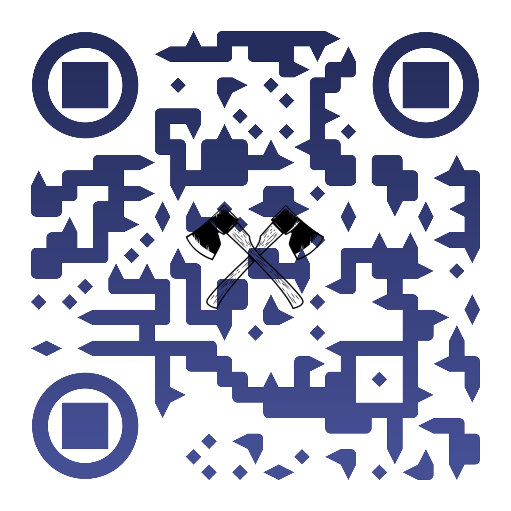

---
<h1 align="center"> 
  Puchar Topora Ski Tournament
</h1>

This web application was created for the ski competition to represent the event. 
It is available at: (http://puchartopora.pl/?i=1). Users have several subpages at their disposal. 
This is the home page where you start using it. The next subpage is a description of the event along with the competition regulations. 
The next element is the section with the results from the previous edition. 
There you can sort the results according to the individual runs of the competitors. The main function of the application is the "live" subpage, 
where competitors and fans can follow the results in real time on the day of the competition. 
The website also includes a gallery with photos from previous editions and a subpage with contact information to the competition organizers. 
In addition to the subpages available to users, an operator panel was created. It is responsible for sending the results obtained by each competitor to the database. 
Then tables with results are dynamically generated. The application has been designed responsively to be readable on both larger screens and mobile devices. 
At the bottom of the page there is also a footer with hyperlinks to social media related to the event. The application structure was made in HTML and styled using CSS. 
JavaScript is responsible for some functionalities, such as a counter or photo gallery browsers. 
The database was created using SQLite, while PHP is responsible for the backend layer, i.e. connection to the database and dynamic generation of content on the website.

